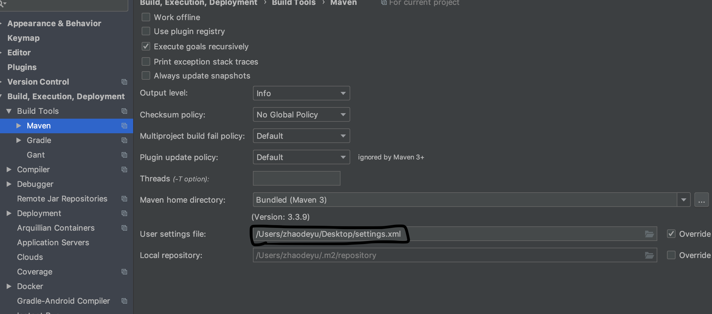

# IntelliJ IDEA开发
## 2019.6.12 Maven依赖无法导入，出现大量红色波浪线

1、确保当前项目为maven管理

2、网络上出现过两种情况：一种重新删除重新导入即可、另一种需要删除.m2/repository文件夹下的所有包再重新导入

3、本次出现的问题是需要在preference下的的maven中配置本机的settings.xml文件(使用的是第三方提供的xml文件)

