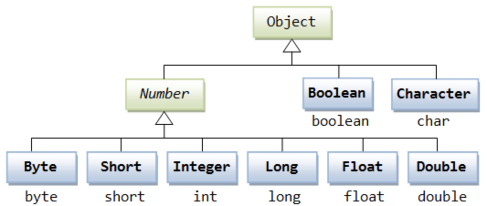

# JAVA基础
## Java面向对象的特征
* 封装：在面向对象语言中，封装特性是由类来体现的，我们将现实生活中的一类实体定义成类，其中包括属性和行为
* 抽象：抽象就是将一类实体的共同特性抽象出来，封装在一个抽象类中，所以抽象在面向对象语言是由抽象类来体现的。
* 继承：继承就像是我们现实生活中的父子关系，儿子可以遗传父亲的一些特性，在面向对象语言中，就是一个类可以继承另一个类的一些特性。
* 多态：简单来说就是用同样的对象引用调用同样的方法但是做了不同的事情，分为编译时的多态性和运行时的多态性。方法重载（Overloading）实现的是编译时的多态性；方法重写（Overriding）实现的是运行时的多态性。

## 装箱和拆箱
为什么需要装箱和拆箱:是java早年设计缺陷。基础类型是数据，不是对象，也不是Object的子类。
 
装箱就是自动将基本数据类型转换为包装器类型；拆箱就是自动将包装器类型转换为基本数据类型。
 
eg:
 
Integer a = Integer.valueOf(123);//装箱 
 
int b = a.intValue(); //拆箱
 

## == 和 equals()的区别

==:

1、基本数据类型，也称原始数据类型。byte,short,char,int,long,float,double,boolean他们之间的比较，应用双等号（==）,比较的是他们的值。

2.复合数据类型(类) 当他们用（==）进行比较的时候，比较的是他们在内存中的存放地

equals():

Java 语言里的equals方法其实是交给开发者去覆写的，让开发者自己去定义满足什么条件的两个Object是equal的。

## String,StringBuilder,StringBuffer的区别
* 运行速度:StringBuilder >StringBuffer >String
>String是字符串常量（final），而StringBuilder和StringBuffer是字符串变量，即String对象一
>旦创建就无法更改，但后两者可以更改。Java中对String对象的更改操作其实只是不断创建新的String并
>回收旧String的过程，所以执行速度很慢。而StringBuilder和StringBuffer就是直接修改变量的值，
>所以速度快很多。
* 线程安全:StringBuilder是线程不安全的，而StringBuffer是线程安全的
* 使用场景
