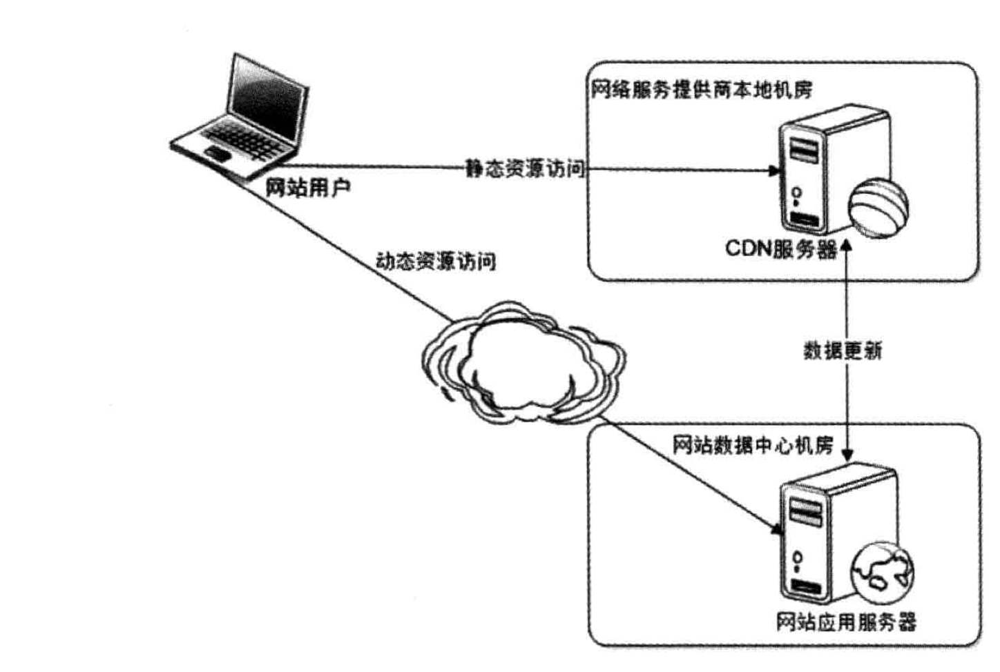
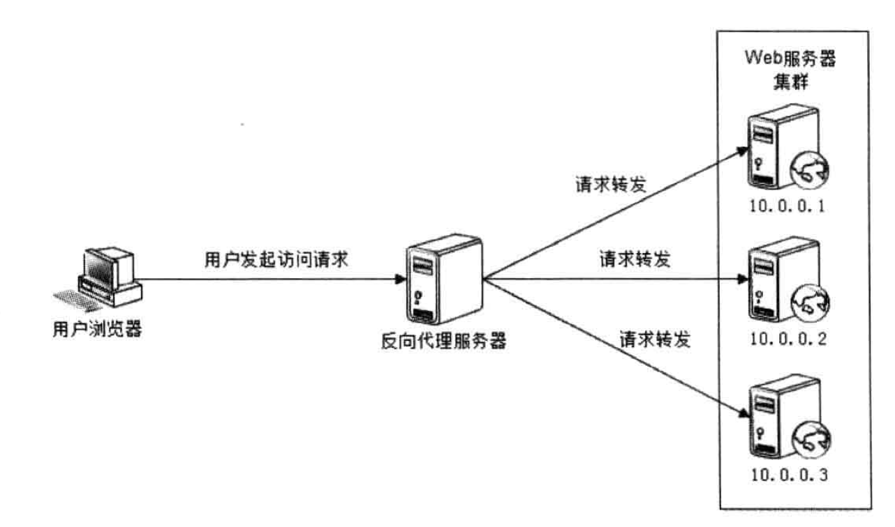

# 性能优化

### Web前端性能优化
1. 浏览器访问优化
* 减少http请求
    ```
    HTTP协议是无状态的应用层协议;
    每次HTTP请求都需要建立通信链路、进行数据传输;
    在服务器端，每个HTTP请求需要启动独立的线程;
    处理这些开销都很昂贵，减少HTTP请求的数目能有效提高访问性能。
    减少HTTP请求主要通过合并css，js，图片
    可以将css，js合并成一个文件，这样只需要请求一次
    如果每张图片有不同的超链接，可通过css偏移响应鼠标点击，构造URL
    ```
* 使用浏览器缓存
    ```
    设置HTTP头中Cache-Control和Expires的属性，设定浏览器缓存时间；
    静态资源更新到浏览器时，为了保证时效性，生成一个新的js文件，并更新HTML中的引用；
    更新缓存需要采用批量更新，但是文件需要一个一个逐步更新，并有一定时间间隔，避免大量缓存失效，造成服务器负载骤增。
    ```
* 启用压缩
    ```
    在服务器端压缩，在浏览器端解压，减少数据通信量
    HTML、CSS、JS文件使用GZip压缩
    但是压缩对服务器和浏览器有一定压力，在带宽良好、服务器资源不足时，需要权衡考虑
    ```
* CSS放在上方，JS放在下方
    ```
    浏览器会在下载完全部CSS对页面进行渲染，所以CSS放在上方可以尽快下载
    浏览器执行到JS会立即执行，有可能造成页面卡顿，所以需要放在页面下方
    但是页面解析时用到的JS则不能放在下方
    ```
* 减少Cookie传输
    ```
    Cookie包含在每次的请求和响应中，过大的数据量会影响传输速度
    静态资源使用单独域名，避免请求静态资源时发送Cookie
    ```
2. CDN加速

* CDN(Content Distribute NetWork，内容分发网络)的本质仍然是一个缓存，而且是将数据缓存在离用户最近的地方(最短路径访问)，即网络访问第一跳

3. 反向代理

* 反向代理可以保护网站
* 同样可以起到缓存的作用，在用户第一次访问静态资源时，反向代理服务器就会进行缓存，减轻Web服务器压力；当动态内容变化时，反向代理会让缓存失效，并重新缓存新的内容
* 可以实现负载均衡功能
